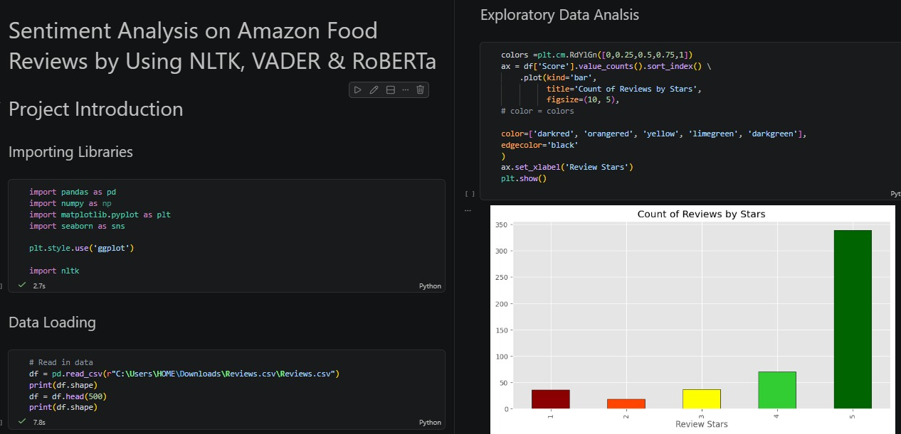
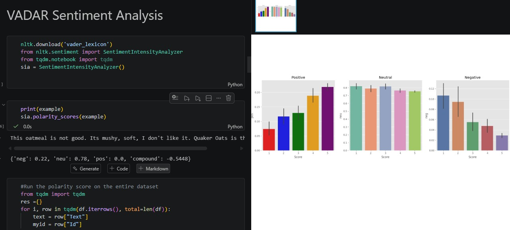
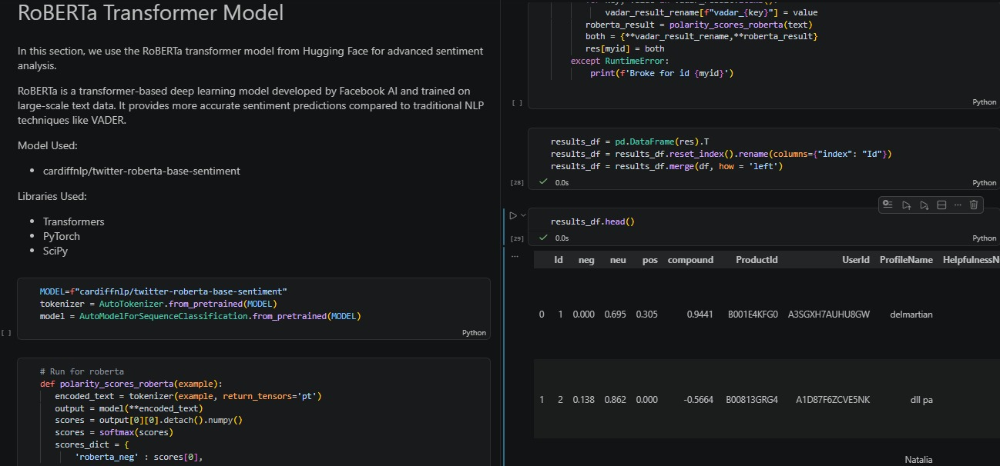
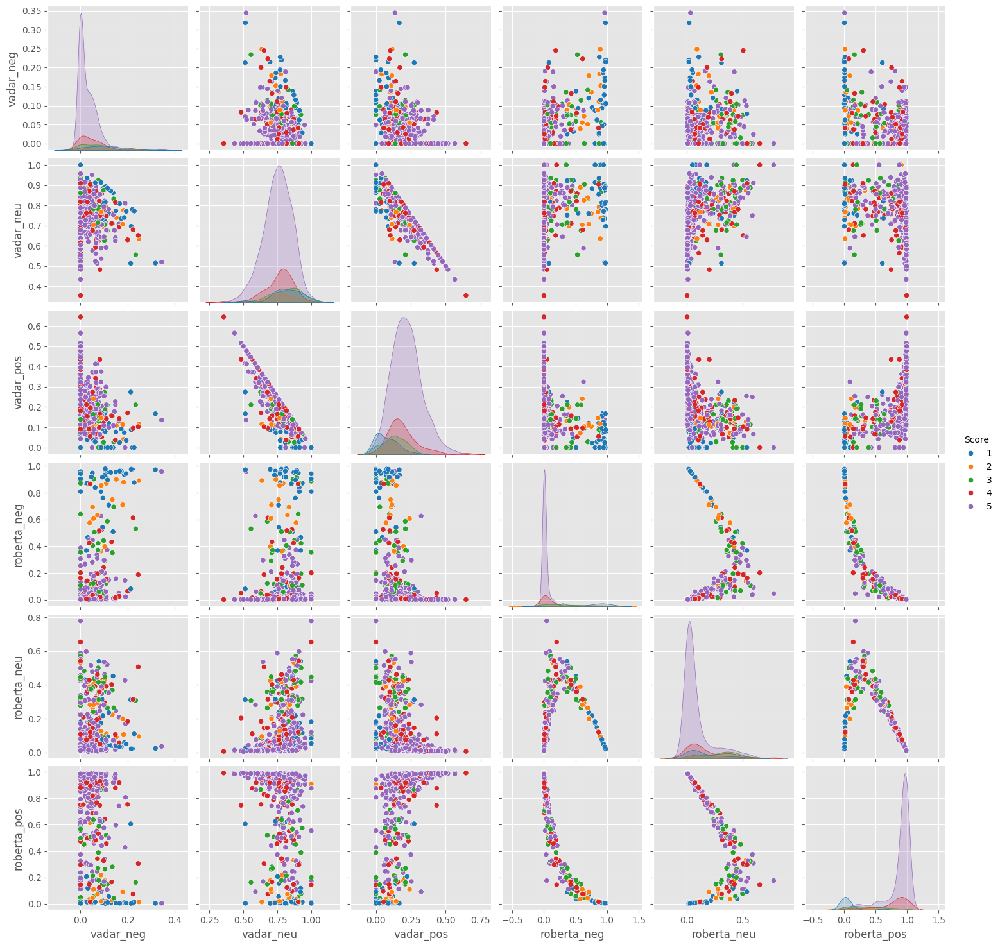
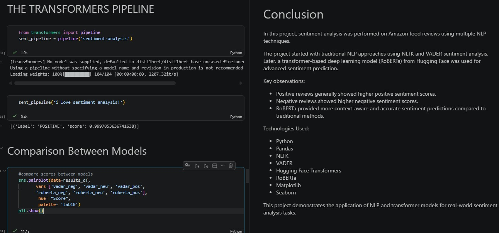

# Sentiment Analysis on Amazon Food Reviews using NLTK, VADER and RoBERTa

## Project Overview
This project performs sentiment analysis on Amazon food reviews using traditional NLP techniques and transformer-based models.

## Technologies Used
- Python
- Pandas
- NLTK
- VADER
- Hugging Face Transformers
- RoBERTa
- Matplotlib
- Seaborn

## Features
- Exploratory Data Analysis
- Sentiment Visualization
- VADER Sentiment Analysis
- RoBERTa Transformer Model
- Model Comparison using Pairplots

## Dataset
Amazon Fine Food Reviews Dataset

## Screenshots

---

### Project Introduction and Exploratory Data Analysis

Overview of the NLP sentiment analysis project along with exploratory data analysis on Amazon food reviews.

![Project Introduction and EDA] 
---

### VADER Sentiment Distribution

Visualization of positive, neutral and negative sentiment scores generated using the VADER sentiment analyzer.

![VADER Sentiment Distribution] 

---

### RoBERTa Transformer Model

Implementation of the RoBERTa transformer-based deep learning model for advanced sentiment analysis using Hugging Face Transformers.

![RoBERTa Transformer Model] 

---

### Comparison Between VADER and RoBERTa Models

Pairplot visualization comparing sentiment score relationships between traditional NLP (VADER) and transformer-based NLP (RoBERTa).

---

### Transformers Pipeline and Conclusion

Demonstration of Hugging Face transformers pipeline for sentiment prediction along with final project conclusions.

![Pipeline and Conclusion]

# THE END